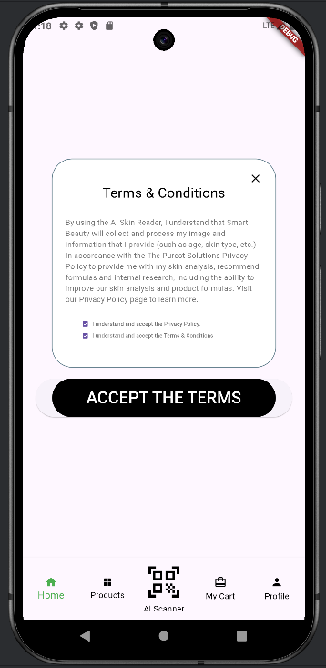
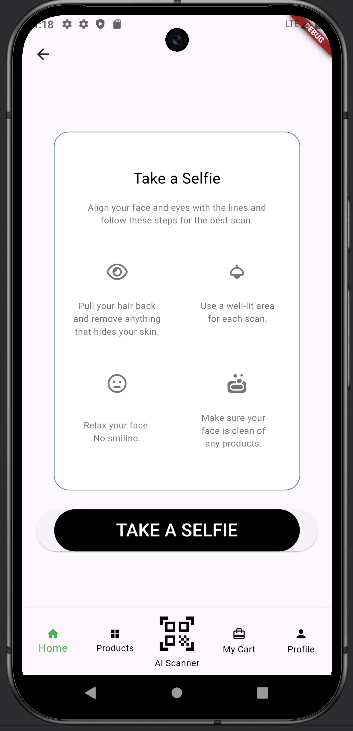
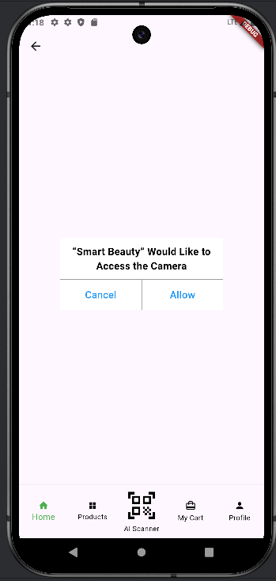

# MobilFlutterProjects
In this section, I am sharing the mobile application projects I have made with flutter.

## 1-AppPermission Project
#### By accepting the necessary permissions of an application in this project, we allow the mobile application to access the necessary phone components.
### 1-AppPermission Project Images

